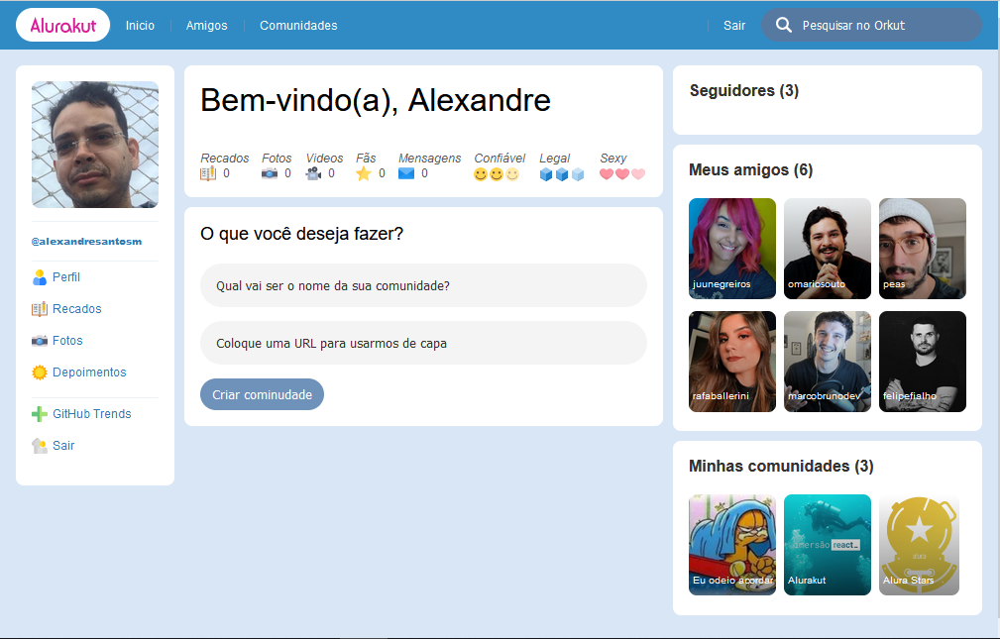
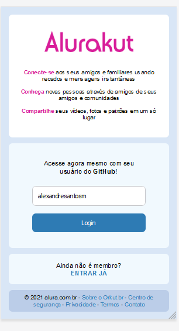
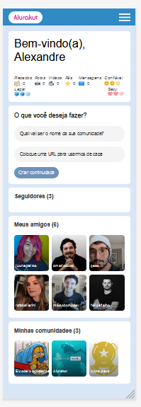
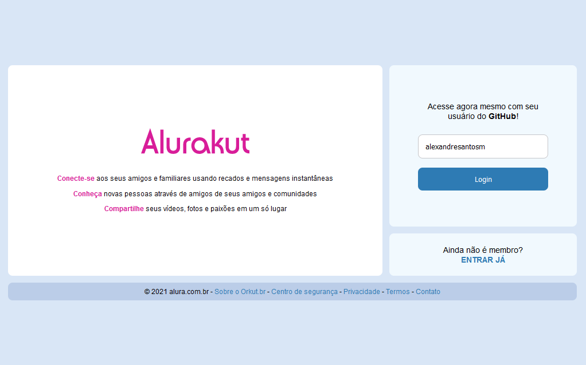

  

  

  

  

<h1 align="center">
  
</h1>

 

## 🧪 Tecnologias

Este projeto foi desenvolvido durante a Imersão React da [Alura](https://www.alura.com.br), que ocorreu no período de 12 a 16 de junho de 2021.

A aplicação desenvolvida utiliza as seguintes tecnologias:

- [Next.js](https://nextjs.org)
- [Prismic](https://prismic.io)
- [Styled Components](https://styled-components.com)
- [Nookies](https://www.npmjs.com/package/nookies)
- [Json Web Token](https://www.npmjs.com/package/jsonwebtoken)

 

## 🎨 Projeto

Alurakut é uma aplicação repaginada do nostalgico orkut.

 

## ✅ Demonstração da aplicação

## 📱 Mobile

Página de Login

  

Página Home

  

 

## 💻 Desktop

Página de Login

  

Página Home

  

 

## 📝 License

Esse projeto está sob a licença MIT. Veja o arquivo [LICENSE](LICENSE.md) para mais detalhes.

---

Feito com 💜 by Alexandre 👋🏻
